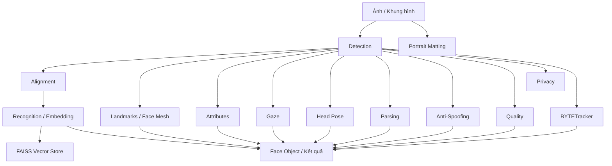
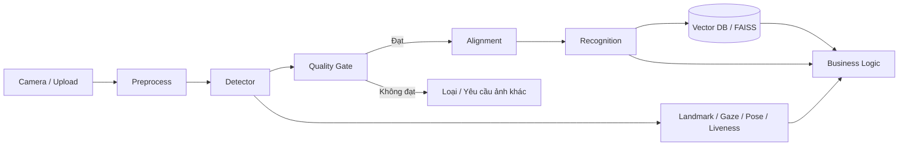

# Tổng quan kiến trúc

UniFace được thiết kế như một **thư viện phân tích khuôn mặt dạng module, sẵn sàng cho triển khai**, trong đó mỗi nhóm tác vụ được xử lý bởi một thành phần chuyên biệt nhưng chia sẻ cùng quy ước dữ liệu.

---

## Kiến trúc tổng thể



### Ý nghĩa của kiến trúc này

UniFace không ép mọi bài toán qua một model duy nhất. Thay vào đó:

- **Detection** trả về vị trí khuôn mặt và landmark cơ bản.
- **Alignment** chuẩn hóa pose/crop trước bước nhận dạng.
- **Recognition** biến khuôn mặt thành vector embedding.
- **Landmark / Face Mesh** mô tả hình học chi tiết.
- **Predictor** bổ sung thuộc tính, gaze, head pose, quality hoặc liveness.
- **Tracking** nối các detection theo thời gian.
- **Vector Store** lưu embedding và tìm hàng xóm gần nhất.

Nhờ vậy, bạn chỉ nạp đúng thành phần cần thiết thay vì phải chạy toàn bộ hệ thống.

---

## Bốn nguyên lý thiết kế chính

### 1. Một API, nhiều mô hình

Các detector/recognizer/predictor khác nhau được bọc dưới các class có quy ước tương tự. Điều này làm giảm phần “keo” khi thay model.

```python
from uniface.detection import RetinaFace, SCRFD

retina = RetinaFace()
scrfd = SCRFD()
```

Việc đổi detector không bắt buộc phải viết lại toàn bộ pipeline phía sau.

### 2. Model chỉ tải khi cần

Trọng số không phải lúc nào cũng đóng gói cùng thư viện. UniFace tải model ở lần dùng đầu, xác minh checksum rồi cache cục bộ.

```text
Khởi tạo model
   ↓
Kiểm tra cache
   ↓
Có? ── Có ──→ Nạp model
 │
 Không
 ↓
Tải trọng số → SHA-256 → Cache → Nạp model
```

Cách này giữ package Python gọn hơn nhưng đồng nghĩa môi trường production nên chủ động **pre-cache model** nếu máy không có Internet.

### 3. Tách runtime CPU và GPU

UniFace dùng ONNX Runtime làm backend chính. Hai extra:

```bash
pip install "uniface[cpu]"
pip install "uniface[gpu]"
```

được tách riêng để tránh xung đột giữa `onnxruntime` và `onnxruntime-gpu`.

### 4. Từ low-level đến high-level

Bạn có thể dùng trực tiếp từng module hoặc dùng `FaceAnalyzer` để ghép pipeline phổ biến.

Low-level:

```python
from uniface.detection import RetinaFace
from uniface.recognition import ArcFace

detector = RetinaFace()
recognizer = ArcFace()
```

High-level:

```python
from uniface import FaceAnalyzer

analyzer = FaceAnalyzer()
faces = analyzer.analyze(image)
```

---

## Cấu trúc module

```text
uniface/
├── detection/      # Phát hiện khuôn mặt
├── recognition/    # Embedding / nhận dạng
├── tracking/       # BYTETracker
├── landmark/       # 68 / 98 / 106 / 468 / 478 điểm
├── attribute/      # Tuổi, nhóm tuổi, cảm xúc, trạng thái
├── parsing/        # Phân vùng ngữ nghĩa
├── matting/        # MODNet / alpha matte
├── gaze/           # Hướng nhìn
├── headpose/       # Pitch / yaw / roll
├── spoofing/       # Liveness
├── quality/        # Face image quality
├── privacy/        # Ẩn danh hóa
├── stores/         # FAISS vector store
├── types.py        # Kiểu dữ liệu dùng chung
├── constants.py    # Trọng số / URL model
├── model_store.py  # Download + cache + checksum
├── onnx_utils.py   # ONNX Runtime helpers
└── draw.py         # Visualization
```

---

## Luồng dữ liệu điển hình

Ví dụ pipeline detection → recognition → attributes:

```python
import cv2
from uniface.attribute import AgeGender
from uniface.detection import RetinaFace
from uniface.recognition import ArcFace

image = cv2.imread("photo.jpg")

detector = RetinaFace()
recognizer = ArcFace()
age_gender = AgeGender()

faces = detector.detect(image)

for face in faces:
    embedding = recognizer.get_normalized_embedding(image, face.landmarks)
    attrs = age_gender.predict(image, face)

    print("BBox:", face.bbox)
    print("Embedding:", embedding.shape)
    print("Tuổi ước lượng:", attrs.age)
    print("Giới tính mô hình:", attrs.sex)
```

### Điểm cần hiểu

`Face` là đối tượng mang dữ liệu qua pipeline. Một số trường luôn có sau detection, trong khi các trường khác chỉ xuất hiện sau khi predictor tương ứng chạy. Vì vậy `None` không nhất thiết là lỗi; có thể đơn giản là module đó chưa được gọi.

---

## `FaceAnalyzer` làm gì?

`FaceAnalyzer` là façade ở mức cao hơn để gom các bước thường dùng:

```python
from uniface import FaceAnalyzer, FairFace

analyzer = FaceAnalyzer(predictors=[FairFace()])
faces = analyzer.analyze(image)
```

Về bản chất, nó điều phối các bước thay vì thay thế từng model bên dưới.

Nên dùng `FaceAnalyzer` khi:

- cần prototype nhanh;
- muốn pipeline mặc định hợp lý;
- không muốn tự ghép detector + recognizer + predictor.

Nên dùng module riêng khi:

- cần benchmark chính xác từng model;
- muốn kiểm soát crop/alignment;
- tối ưu latency/memory;
- chạy streaming hoặc multi-stage pipeline;
- cần thay threshold theo từng giai đoạn.

---

## Tăng tốc phần cứng

UniFace cố gắng chọn execution provider phù hợp với môi trường. Tuy nhiên trong production nên **kiểm tra provider thật sự được dùng**, không chỉ dựa vào việc máy có GPU.

```python
import onnxruntime as ort
print(ort.get_available_providers())
```

Ví dụ:

```text
['CUDAExecutionProvider', 'CPUExecutionProvider']
```

Nếu chỉ thấy CPU, suy luận đang chạy CPU.

---

## Cache và triển khai offline

Vị trí mặc định:

```text
~/.uniface/models
```

Đổi bằng Python:

```python
from uniface.model_store import set_cache_dir
set_cache_dir("D:/AI/uniface-models")
```

Trong hệ thống offline hoặc air-gapped, nên tải sẵn toàn bộ trọng số cần dùng rồi đóng băng cache cùng phiên bản thư viện.

---

## Kiến trúc production gợi ý



Điểm đáng chú ý là **Quality Gate** nên đặt trước recognition trong các hệ thống nghiêm túc. Ảnh quá mờ, quá nhỏ hoặc pose xấu có thể làm embedding kém ổn định.

---

## Ngưỡng không phải hằng số tuyệt đối

Threshold nhận dạng, liveness hoặc quality phụ thuộc:

- model;
- dataset;
- camera;
- ánh sáng;
- độ phân giải;
- khoảng cách;
- yêu cầu FAR/FRR của ứng dụng.

Không nên sao chép một threshold từ demo rồi dùng nguyên xi trong production. Hãy hiệu chuẩn trên dữ liệu đại diện cho môi trường thật.

---

## Hạn chế cần nhớ

- Dự đoán thuộc tính khuôn mặt có thể có sai lệch giữa nhóm dữ liệu.
- Emotion recognition chỉ phản ánh pattern học từ dataset, không đọc được “trạng thái nội tâm”.
- Liveness model không bảo đảm chống mọi kiểu presentation attack.
- Face recognition nên được đánh giá bằng FAR/FRR hoặc ROC trên dữ liệu mục tiêu.
- Face Mesh 3D là hình học tương đối, không tự động trở thành mô hình 3D metric chính xác tuyệt đối.

---

## Bước tiếp theo

- [Dữ liệu vào & ra](inputs-outputs.md)
- [Hệ tọa độ](coordinate-systems.md)
- [Execution Providers](execution-providers.md)
- [Model Cache & Offline](model-cache-offline.md)
- [Threshold & Calibration](thresholds-calibration.md)
- [Detection API](../modules/detection.md)
