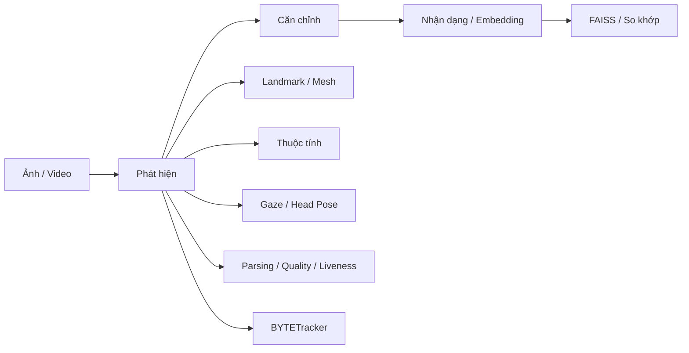

---
hide:
  - toc
  - navigation
  - edit
template: home.html
---

<div class="hero" markdown>

# UniFace Việt Nam { .hero-title }

<p class="hero-subtitle">Một API thống nhất cho toàn bộ pipeline phân tích khuôn mặt bằng Python</p>

[](https://pypi.org/project/uniface/)
[](https://www.python.org/)
[](https://github.com/yakhyo/uniface/blob/main/LICENSE)
[](https://github.com/yakhyo/uniface)

[:material-rocket-launch: Bắt đầu trong 5 phút](quickstart.md){ .md-button .md-button--primary }
[:material-github: Mã nguồn Việt hóa](https://github.com/Base27-CVNSS/vi-uniface){ .md-button }

</div>

!!! info "Bản Việt hóa giữ nguyên lõi kỹ thuật"
    `vi-uniface` là nhánh Việt hóa và biên soạn tài liệu của **UniFace**. Lõi thư viện, API Python, mô hình và cơ chế suy luận vẫn tương thích với dự án gốc `yakhyo/uniface`. Mục tiêu của bản này là giúp người dùng Việt Nam hiểu đúng **bản chất, kiến trúc, luồng dữ liệu và cách triển khai** thay vì chỉ dịch tên lệnh.

<div class="feature-grid" markdown>

<div class="feature-card" markdown>
### :material-face-recognition: Phát hiện khuôn mặt
RetinaFace, SCRFD, CenterFace, YOLOv5/YOLOv8-Face và BlazeFace; trả về hộp bao, độ tin cậy và landmark cơ bản.
<a class="feature-card-link" href="modules/detection/" aria-label="Phát hiện khuôn mặt"></a>
</div>

<div class="feature-card" markdown>
### :material-account-check: Nhận dạng khuôn mặt
AdaFace, ArcFace, EdgeFace, MobileFace và SphereFace biến khuôn mặt thành embedding để xác minh hoặc tìm kiếm danh tính.
<a class="feature-card-link" href="modules/recognition/" aria-label="Nhận dạng khuôn mặt"></a>
</div>

<div class="feature-card" markdown>
### :material-vector-polyline: Landmark & Face Mesh
Hỗ trợ landmark 68/98/106 điểm và mesh 3D 468/478 điểm, phù hợp căn chỉnh, đo hình học, AR và phân tích biểu cảm.
<a class="feature-card-link" href="modules/landmarks/" aria-label="Landmark và Face Mesh"></a>
</div>

<div class="feature-card" markdown>
### :material-account-details: Thuộc tính khuôn mặt
Ước lượng nhóm tuổi, giới tính mô hình, nhóm nhân khẩu học, cảm xúc và trạng thái như kính, khẩu trang, mắt mở/nhắm.
<a class="feature-card-link" href="modules/attributes/" aria-label="Thuộc tính khuôn mặt"></a>
</div>

<div class="feature-card" markdown>
### :material-face-man-shimmer: Phân vùng khuôn mặt
BiSeNet tách khuôn mặt thành 19 vùng ngữ nghĩa; XSeg tạo mask phục vụ ghép ảnh, chỉnh sửa và hậu kỳ.
<a class="feature-card-link" href="modules/parsing/" aria-label="Phân vùng khuôn mặt"></a>
</div>

<div class="feature-card" markdown>
### :material-image-off: Tách nền chân dung
MODNet tạo alpha matte không cần trimap để xóa nền, thay nền, compositing và tạo ảnh PNG trong suốt.
<a class="feature-card-link" href="modules/matting/" aria-label="Tách nền chân dung"></a>
</div>

<div class="feature-card" markdown>
### :material-eye: Ước lượng hướng nhìn
MobileGaze ước lượng pitch/yaw của ánh mắt theo thời gian thực cho HCI, attention analysis và giao diện điều khiển bằng mắt.
<a class="feature-card-link" href="modules/gaze/" aria-label="Ước lượng hướng nhìn"></a>
</div>

<div class="feature-card" markdown>
### :material-axis-arrow: Tư thế đầu 3D
Ước lượng pitch, yaw, roll bằng biểu diễn quay 6D để biết đầu đang quay/ngẩng/cúi theo hướng nào.
<a class="feature-card-link" href="modules/headpose/" aria-label="Tư thế đầu"></a>
</div>

<div class="feature-card" markdown>
### :material-motion-play: Theo dõi khuôn mặt
BYTETracker duy trì ID ổn định qua nhiều khung hình, tạo nền cho video analytics và pipeline thời gian thực.
<a class="feature-card-link" href="modules/tracking/" aria-label="Theo dõi khuôn mặt"></a>
</div>

<div class="feature-card" markdown>
### :material-shield-check: Chống giả mạo
MiniFASNet ước lượng liveness nhằm phân biệt khuôn mặt thật với ảnh, màn hình hoặc một số kiểu replay attack.
<a class="feature-card-link" href="modules/spoofing/" aria-label="Chống giả mạo"></a>
</div>

<div class="feature-card" markdown>
### :material-star-check: Chất lượng khuôn mặt
eDifFIQA tạo điểm chất lượng để lọc ảnh xấu trước bước nhận dạng, giúp giảm embedding kém tin cậy.
<a class="feature-card-link" href="modules/quality/" aria-label="Chất lượng khuôn mặt"></a>
</div>

<div class="feature-card" markdown>
### :material-blur: Bảo vệ riêng tư
Năm phương pháp làm mờ/che khuôn mặt hỗ trợ ẩn danh hóa ảnh và video trước khi chia sẻ hoặc phân tích tiếp.
<a class="feature-card-link" href="modules/privacy/" aria-label="Bảo vệ riêng tư"></a>
</div>

<div class="feature-card" markdown>
### :material-database-search: Tìm kiếm vector
FAISS lưu và truy vấn embedding để tìm khuôn mặt tương tự trên tập dữ liệu lớn với độ trễ thấp.
<a class="feature-card-link" href="modules/stores/" aria-label="Tìm kiếm vector"></a>
</div>

</div>

---

## Bản chất kiến trúc

UniFace không phải một “siêu mô hình” duy nhất. Đây là **lớp hợp nhất nhiều mô hình chuyên biệt dưới một quy ước API chung**:



Điểm mạnh của cách thiết kế này là bạn có thể dùng từng module độc lập hoặc ghép chúng thành pipeline thông qua `FaceAnalyzer`. Mô hình được tải khi cần, kiểm tra checksum và chạy chủ yếu trên **ONNX Runtime**, giúp cùng một codebase hoạt động trên CPU, Apple Silicon và NVIDIA CUDA.

---

## Cài đặt

=== "CPU / Apple Silicon"

    ```bash
    pip install "uniface[cpu]"
    ```

=== "NVIDIA GPU (CUDA)"

    ```bash
    pip install "uniface[gpu]"
    ```

=== "Từ mã nguồn Việt hóa"

    ```bash
    git clone https://github.com/Base27-CVNSS/vi-uniface.git
    cd vi-uniface
    pip install -e ".[cpu]"   # đổi thành .[gpu] nếu dùng NVIDIA CUDA
    ```

!!! warning "Không cài đồng thời hai runtime ONNX"
    `onnxruntime` và `onnxruntime-gpu` dùng cùng namespace Python. Hãy chọn **một** biến thể `cpu` hoặc `gpu` để tránh xung đột provider.

---

## Pipeline đầu tiên

```python
import cv2
from uniface import FaceAnalyzer

analyzer = FaceAnalyzer()
image = cv2.imread("photo.jpg")
faces = analyzer.analyze(image)

for face in faces:
    print("BBox:", face.bbox)
    print("Confidence:", face.confidence)
    print("Embedding:", face.embedding.shape if face.embedding is not None else None)
```

`FaceAnalyzer()` mặc định thực hiện phát hiện + căn chỉnh + embedding. Các mô hình thuộc tính là **opt-in**: chỉ được chạy khi bạn chủ động truyền predictor tương ứng.

---

## Nên dùng module nào?

| Nhu cầu | Module gợi ý | Kết quả chính |
|---|---|---|
| Tìm khuôn mặt trong ảnh | Detection | `bbox`, confidence, 5-point landmarks |
| Xác minh hai ảnh có cùng người | Recognition | embedding + cosine similarity |
| Theo dõi người qua video | Detection + BYTETracker | ID theo thời gian |
| Xây avatar/AR/đo hình học | Landmark / Face Mesh | 2D/3D keypoints |
| Tách tóc, da, mắt, miệng | Parsing | mask ngữ nghĩa |
| Xóa/thay nền chân dung | Matting | alpha matte |
| Biết hướng nhìn | Gaze | pitch/yaw ánh mắt |
| Biết hướng quay đầu | Head Pose | pitch/yaw/roll đầu |
| Chống ảnh chụp lại | Anti-Spoofing | liveness score |
| Lọc ảnh trước nhận dạng | Quality | quality score |
| Ẩn danh dữ liệu | Privacy | ảnh/video đã che mặt |
| Tìm kiếm trên kho lớn | FAISS Store | nearest embeddings |

---

## Bước tiếp theo

<div class="next-steps-grid" markdown>

<div class="feature-card" markdown>
### :material-download: Cài đặt
Thiết lập CPU, Apple Silicon hoặc CUDA và xử lý các lỗi runtime thường gặp.
<a class="feature-card-link" href="installation/" aria-label="Cài đặt"></a>
</div>

<div class="feature-card" markdown>
### :material-rocket-launch: Khởi động nhanh
Chạy những pipeline phổ biến nhất bằng các đoạn mã ngắn, có giải thích đầu vào và đầu ra.
<a class="feature-card-link" href="quickstart/" aria-label="Khởi động nhanh"></a>
</div>

<div class="feature-card" markdown>
### :material-family-tree: Kiến trúc
Hiểu luồng dữ liệu, vòng đời mô hình, provider phần cứng và cách các module phối hợp.
<a class="feature-card-link" href="concepts/overview/" aria-label="Kiến trúc"></a>
</div>

<div class="feature-card" markdown>
### :material-api: Tham chiếu API
Đi sâu vào từng detector, recognizer, landmark, parser, gaze, liveness và vector store.
<a class="feature-card-link" href="modules/detection/" aria-label="Tham chiếu API"></a>
</div>

</div>

---

## Trách nhiệm sử dụng

Phân tích khuôn mặt có thể tác động đến quyền riêng tư và tạo sai lệch nếu dùng thiếu kiểm soát. Không nên xem đầu ra về nhân khẩu học, cảm xúc hoặc liveness là “sự thật tuyệt đối”. Với hệ thống định danh, kiểm soát truy cập, y tế hoặc quyết định có ảnh hưởng lớn, cần kiểm định trên dữ liệu phù hợp, hiệu chuẩn ngưỡng, đánh giá sai số và có cơ chế con người giám sát.

## Giấy phép & ghi công

Lõi UniFace được phát hành theo **MIT License**. Một số trọng số mô hình có giấy phép riêng, vì vậy cần kiểm tra trang [Giấy phép & ghi công](license-attribution.md) trước khi dùng thương mại. Bản Việt hóa này ghi công đầy đủ cho tác giả và dự án gốc [yakhyo/uniface](https://github.com/yakhyo/uniface).
